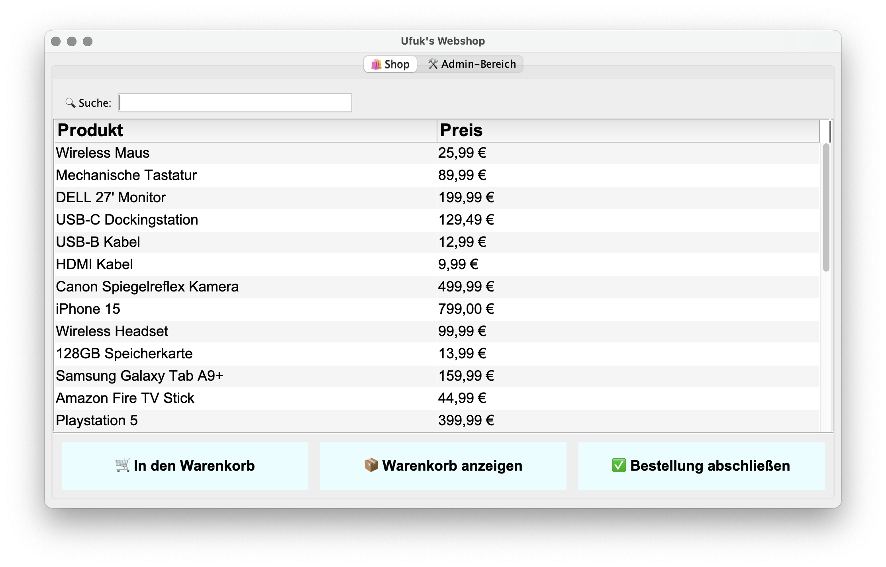

# Mini Webshop (Java)

Ein kleines Java-Projekt zur Simulation eines Webshops mit Produktverwaltung und Warenkorb.

## Screenshot

## Features

- Anzeige von Produkten
- Produkte zum Warenkorb hinzufügen
- Warenkorb verwalten
- Admin Panel zur Produktverwaltung
- GUI mit Java Swing

## Technologien

- Java
- Maven
- Swing
- Objektorientierte Architektur

## Projektstruktur

model – Datenmodelle wie Product und CartItem  
service – Geschäftslogik (CartService, ProductService)  
gui – Benutzeroberfläche

## Starten

Repository klonen:

git clone https://github.com/ufukibis20/miniwebshop.git

Dann in IntelliJ oder Eclipse öffnen und starten.